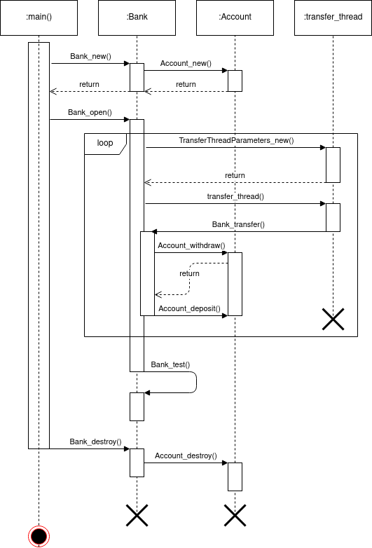

# BankSim

### The Initial Race Condition

##### Explanation

Originally, `Bank_open()` starts a loop, creating multiple threads that all interact asynchronously with the list of accounts, moving money from one to another. There is a race condition here, where interrupts occur while threads access the accounts, allowing control to pass to other threads without account balances being updated. For instance, thread A could be interrupted right after it checks to see if an account has sufficient funds. Thread B could then also accesses that account and move money to a different account. Control could then be returned to thread A, which then withdraws money from that account that is no longer there. If thread A then deposits that money in another account, we have just created money that doesn't exist.

##### Program Flow

